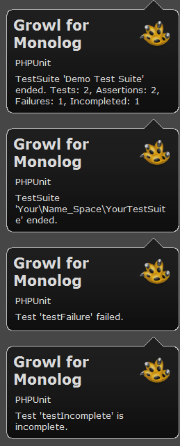

<!-- markdownlint-disable MD013 MD046 -->
# PHPUnit Test Suite listener for compatible PSR-3 logger

[](https://packagist.org/packages/bartlett/phpunit-loggertestlistener)
[](https://php.net/)


Goal is to provide a standard PHPUnit Listener that is capable to send unit test results
to any PSR-3 compatible logger.

The listener implement the `PHPUnit\Framework\TestListener` interface,
and used these log levels/events mapping.

**ERROR**

    - `addError()`, when an error occurred
    - `addFailure()`, when a failure occured

**WARNING**

    - `addWarning()`, on warning test
    - `addIncompleteTest()`, on incomplete test
    - `addRiskyTest()`, on risky test
    - `addSkippedTest()`, when a test was skipped

**INFO**

    - `startTest()`, when a test started
    - `endTest()`, when a test ended

**NOTICE**

    - `startTestSuite()`, when a test suite started
    - `endTestSuite()`, when a test suite ended

## Installation

**IMPORTANT**: For demonstration purpose, a Growl Handler and an AdvancedFilter Handler were used but are not yet available as a GitHub or Packagist version.

```shell
composer require bartlett/phpunit-loggertestlistener
```


## Usage with basic PSR-3 Logger

We will use a very basic PSR-3 logger for our first steps. Suppose we have such following implementation.

```php
<?php

use Psr\Log\AbstractLogger;

class YourLogger extends AbstractLogger
{
    private $channel;

    public function __construct($name = 'YourLoggerChannel')
    {
        $this->channel = $name;
    }

    public function log($level, $message, array $context = array())
    {
        error_log(
            sprintf(
                '%s.%s: %s',
                $this->channel,
                strtoupper($level),
                $this->interpolate($message, $context)
            )
        );
    }

    protected function interpolate($message, array $context = array())
    {
        // build a replacement array with braces around the context keys
        $replace = array();
        foreach ($context as $key => $val) {
            if (is_scalar($val)) {
                $replace['{' . $key . '}'] = $val;
            }
        }

        // interpolate replacement values into the message and return
        return strtr($message, $replace);
    }
}
```


Add in your `phpunit.xml` configuration file the `Bartlett\LoggerTestListener` test listener,
using our basic PSR-3 logger (`YourLogger`).

**Using default behavior of your logger**

```xml
<?xml version="1.0" encoding="UTF-8"?>
<phpunit>
    <listeners>
        <listener class="Bartlett\LoggerTestListener">
            <arguments>
                <object class="YourLogger" />
            </arguments>
        </listener>
    </listeners>
</phpunit>
```

We can change name of the channel (from default `YourLoggerChannel` to value `YourPSR3Logger`) as follow :

**Configure the channel name of your logger**

```xml
<?xml version="1.0" encoding="UTF-8"?>
<phpunit>
    <listeners>
        <listener class="Bartlett\LoggerTestListener">
            <arguments>
                <object class="YourLogger">
                    <arguments>
                        <string>YourPSR3Logger</string>
                    </arguments>
                </object>
            </arguments>
        </listener>
    </listeners>
</phpunit>
```

If you want to have advanced logging strategies, I suggest you to have a look on famous
[Monolog](https://github.com/Seldaek/monolog) PHP Library.

## Usage with Monolog

Without handler (then default output will be send to STDERR), we could have such kind of configuration,
with logger channel name set to `YourMonologChannel`.

```xml
<?xml version="1.0" encoding="UTF-8"?>
<phpunit>
    <listeners>
        <listener class="Bartlett\LoggerTestListener">
            <arguments>
                <object class="Monolog\Logger">
                    <arguments>
                        <string>YourMonologChannel</string>
                    </arguments>
                </object>
            </arguments>
        </listener>
    </listeners>
</phpunit>
```

Add some handlers, with basic logging Monolog Strategy (filter on level only).

```xml
<?xml version="1.0" encoding="UTF-8"?>
<phpunit>
    <listeners>
        <listener class="Bartlett\LoggerTestListener">
            <arguments>
                <object class="Monolog\Logger">
                    <arguments>
                        <string>YourMonologChannel</string>
                        <array>
                            <element>
                                <object class="Monolog\Handler\StreamHandler">
                                    <arguments>
                                        <string>/var/logs/monolog.log</string>
                                    </arguments>
                                </object>
                            </element>
                            <element>
                                <object class="Bartlett\GrowlHandler">
                                    <arguments>
                                        <array></array>
                                        <integer>250</integer> <!-- NOTICE -->
                                    </arguments>
                                </object>
                            </element>
                        </array>
                    </arguments>
                </object>
            </arguments>
        </listener>
    </listeners>
</phpunit>
```

**WARNING**: When we used desktop notification such as [growl](http://growl.info/),
or mobile notifications powered by [Pushover](https://pushover.net/), you probably don't want
to receive all log records, but just the most important ones (errors, failures, testsuites ended).

Actually Monolog can't do this.
So this is the reason of the [Pull Request](https://github.com/Seldaek/monolog/pull/411) to add filter capability.
It's now available as a standalone package. See [Monolog Wiki](https://github.com/Seldaek/monolog/wiki/Third-Party-Packages) page,
and [CallbackFilterHandler](https://github.com/llaville/monolog-callbackfilterhandler) project's page

Now create a pre-defined logger with all handlers we wished on and the filter rules for each handlers.

```php
<?php

use Monolog\Logger;
use Monolog\Handler\StreamHandler;

use Bartlett\Monolog\Handler\GrowlHandler;
use Bartlett\Monolog\Handler\CallbackFilterHandler;

class YourMonolog extends Logger
{
    public function __construct($name = 'PHPUnit')
    {
        $filter1 = function($record, $handlerLevel) {
            if ($record['level'] < $handlerLevel) {
                return false;
            }
            if ($record['level'] > $handlerLevel) {
                return true;
            }
            return (
                preg_match('/^TestSuite(.*)ended\./', $record['message']) === 1
                and
                $record['level'] == $handlerLevel
            );
        };

        $stream = new StreamHandler('/var/logs/monolog.log');

        $handlers = [$stream];

        try {
            $growl = new GrowlHandler(array(), Logger::NOTICE);

            $filterGrowl = new CallbackFilterHandler(
                $growl,
                array($filter1)
            );
            $handlers[] = $filterGrowl;

        } catch (\Exception $e) {
            // Growl client is probably not started
            echo $e->getMessage(), PHP_EOL, PHP_EOL;
        }

        parent::__construct($name, $handlers);
    }
}
```

And of course, declare our new listener like that :

```xml
<?xml version="1.0" encoding="UTF-8"?>
<phpunit>
    <listeners>
        <listener class="Bartlett\LoggerTestListener">
            <arguments>
                <object class="YourMonolog" />
            </arguments>
        </listener>
    </listeners>
</phpunit>
```

We will get all PHPUnit log messages recorded via the `StreamHandler`,
and only important notifications via `GrowlHandler` (see filter rule with callback `$filter1`).

Run the test suite example :

```shell
phpunit -c examples/phpunit.monolog.xml
```

And you will get something like:

```shell
PHPUnit 7.5.1 by Sebastian Bergmann and contributors.

IRSF....F                                                           9 / 9 (100%)

Time: 79 ms, Memory: 10.00MB

There were 2 failures:

1) Your\Name_Space\YourTestSuite::testFailure
Failed asserting that an array is empty.

/shared/httpd/phpunit-LoggerTestListener/examples/testSuite.php:31

2) Your\Name_Space\YourTestSuite::testDataProvider with data set #3 (1, 1, 3)
Failed asserting that 2 matches expected 3.

/shared/httpd/phpunit-LoggerTestListener/examples/testSuite.php:44

--

There was 1 risky test:

1) Your\Name_Space\YourTestSuite::testRisky
This test did not perform any assertions

/shared/httpd/phpunit-LoggerTestListener/examples/testSuite.php:20

FAILURES!
Tests: 9, Assertions: 7, Failures: 2, Skipped: 1, Incomplete: 1, Risky: 1.
```

**Test Suite results with Monolog Stream Handler**

```shell
[2018-12-30 11:00:19] PHPUnit.NOTICE: TestSuite 'Demo Test Suite' started with 9 tests. {"suiteName":"Demo Test Suite","testCount":9,"operation":"startTestSuite"} []
[2018-12-30 11:00:19] PHPUnit.NOTICE: TestSuite 'Your\Name_Space\YourTestSuite' started with 9 tests. {"suiteName":"Your\\Name_Space\\YourTestSuite","testCount":9,"operation":"startTestSuite"} []
[2018-12-30 11:00:19] PHPUnit.INFO: Test 'testIncomplete' started. {"testName":"testIncomplete","testDescriptionArr":["Your\\Name_Space\\YourTestSuite","testIncomplete"],"testDescriptionStr":"Your\\Name_Space\\YourTestSuite::testIncomplete","operation":"startTest"} []
[2018-12-30 11:00:19] PHPUnit.WARNING: Test 'testIncomplete' is incomplete. {"testName":"testIncomplete","testDescriptionArr":["Your\\Name_Space\\YourTestSuite","testIncomplete"],"testDescriptionStr":"Your\\Name_Space\\YourTestSuite::testIncomplete","operation":"addIncompleteTest","reason":"This test has not been implemented yet.","trace":"/shared/httpd/phpunit-LoggerTestListener/examples/testSuite.php:16\n"} []
[2018-12-30 11:00:19] PHPUnit.INFO: Test 'testIncomplete' ended. {"testName":"testIncomplete","testDescriptionArr":["Your\\Name_Space\\YourTestSuite","testIncomplete"],"testDescriptionStr":"Your\\Name_Space\\YourTestSuite::testIncomplete","operation":"endTest","output":"","assertionCount":1} []
[2018-12-30 11:00:19] PHPUnit.INFO: Test 'testRisky' started. {"testName":"testRisky","testDescriptionArr":["Your\\Name_Space\\YourTestSuite","testRisky"],"testDescriptionStr":"Your\\Name_Space\\YourTestSuite::testRisky","operation":"startTest"} []
[2018-12-30 11:00:19] PHPUnit.WARNING: Test 'testRisky' is risky. {"testName":"testRisky","testDescriptionArr":["Your\\Name_Space\\YourTestSuite","testRisky"],"testDescriptionStr":"Your\\Name_Space\\YourTestSuite::testRisky","operation":"addRiskyTest","reason":"This test did not perform any assertions\n\n/shared/httpd/phpunit-LoggerTestListener/examples/testSuite.php:20","trace":""} []
[2018-12-30 11:00:19] PHPUnit.INFO: Test 'testRisky' ended. {"testName":"testRisky","testDescriptionArr":["Your\\Name_Space\\YourTestSuite","testRisky"],"testDescriptionStr":"Your\\Name_Space\\YourTestSuite::testRisky","operation":"endTest","output":"","assertionCount":0} []
[2018-12-30 11:00:19] PHPUnit.INFO: Test 'testSkipped' started. {"testName":"testSkipped","testDescriptionArr":["Your\\Name_Space\\YourTestSuite","testSkipped"],"testDescriptionStr":"Your\\Name_Space\\YourTestSuite::testSkipped","operation":"startTest"} []
[2018-12-30 11:00:19] PHPUnit.WARNING: Test 'testSkipped' has been skipped. {"testName":"testSkipped","testDescriptionArr":["Your\\Name_Space\\YourTestSuite","testSkipped"],"testDescriptionStr":"Your\\Name_Space\\YourTestSuite::testSkipped","operation":"addSkippedTest","reason":"This test was skipped for any reason.","trace":"/shared/httpd/phpunit-LoggerTestListener/examples/testSuite.php:26\n"} []
[2018-12-30 11:00:19] PHPUnit.INFO: Test 'testSkipped' ended. {"testName":"testSkipped","testDescriptionArr":["Your\\Name_Space\\YourTestSuite","testSkipped"],"testDescriptionStr":"Your\\Name_Space\\YourTestSuite::testSkipped","operation":"endTest","output":"","assertionCount":0} []
[2018-12-30 11:00:19] PHPUnit.INFO: Test 'testFailure' started. {"testName":"testFailure","testDescriptionArr":["Your\\Name_Space\\YourTestSuite","testFailure"],"testDescriptionStr":"Your\\Name_Space\\YourTestSuite::testFailure","operation":"startTest"} []
[2018-12-30 11:00:19] PHPUnit.ERROR: Test 'testFailure' failed. {"testName":"testFailure","testDescriptionArr":["Your\\Name_Space\\YourTestSuite","testFailure"],"testDescriptionStr":"Your\\Name_Space\\YourTestSuite::testFailure","operation":"addFailure","reason":"Failed asserting that an array is empty.","trace":"/shared/httpd/phpunit-LoggerTestListener/examples/testSuite.php:31\n"} []
[2018-12-30 11:00:19] PHPUnit.INFO: Test 'testFailure' ended. {"testName":"testFailure","testDescriptionArr":["Your\\Name_Space\\YourTestSuite","testFailure"],"testDescriptionStr":"Your\\Name_Space\\YourTestSuite::testFailure","operation":"endTest","output":"","assertionCount":1} []
[2018-12-30 11:00:19] PHPUnit.INFO: Test 'testPass' started. {"testName":"testPass","testDescriptionArr":["Your\\Name_Space\\YourTestSuite","testPass"],"testDescriptionStr":"Your\\Name_Space\\YourTestSuite::testPass","operation":"startTest"} []
[2018-12-30 11:00:19] PHPUnit.INFO: Test 'testPass' ended. {"testName":"testPass","testDescriptionArr":["Your\\Name_Space\\YourTestSuite","testPass"],"testDescriptionStr":"Your\\Name_Space\\YourTestSuite::testPass","operation":"endTest","output":"","assertionCount":1} []
[2018-12-30 11:00:19] PHPUnit.NOTICE: TestSuite 'Your\Name_Space\YourTestSuite::testDataProvider' started with 4 tests. {"suiteName":"Your\\Name_Space\\YourTestSuite::testDataProvider","testCount":4,"operation":"startTestSuite"} []
[2018-12-30 11:00:19] PHPUnit.INFO: Test 'testDataProvider with data set #0' started. {"testName":"testDataProvider with data set #0","testDescriptionArr":["Your\\Name_Space\\YourTestSuite","testDataProvider with data set #0"],"testDescriptionStr":"Your\\Name_Space\\YourTestSuite::testDataProvider with data set #0 (0, 0, 0)","operation":"startTest"} []
[2018-12-30 11:00:19] PHPUnit.INFO: Test 'testDataProvider with data set #0' ended. {"testName":"testDataProvider with data set #0","testDescriptionArr":["Your\\Name_Space\\YourTestSuite","testDataProvider with data set #0"],"testDescriptionStr":"Your\\Name_Space\\YourTestSuite::testDataProvider with data set #0 (0, 0, 0)","operation":"endTest","output":"","assertionCount":1} []
[2018-12-30 11:00:19] PHPUnit.INFO: Test 'testDataProvider with data set #1' started. {"testName":"testDataProvider with data set #1","testDescriptionArr":["Your\\Name_Space\\YourTestSuite","testDataProvider with data set #1"],"testDescriptionStr":"Your\\Name_Space\\YourTestSuite::testDataProvider with data set #1 (0, 1, 1)","operation":"startTest"} []
[2018-12-30 11:00:19] PHPUnit.INFO: Test 'testDataProvider with data set #1' ended. {"testName":"testDataProvider with data set #1","testDescriptionArr":["Your\\Name_Space\\YourTestSuite","testDataProvider with data set #1"],"testDescriptionStr":"Your\\Name_Space\\YourTestSuite::testDataProvider with data set #1 (0, 1, 1)","operation":"endTest","output":"","assertionCount":1} []
[2018-12-30 11:00:19] PHPUnit.INFO: Test 'testDataProvider with data set #2' started. {"testName":"testDataProvider with data set #2","testDescriptionArr":["Your\\Name_Space\\YourTestSuite","testDataProvider with data set #2"],"testDescriptionStr":"Your\\Name_Space\\YourTestSuite::testDataProvider with data set #2 (1, 0, 1)","operation":"startTest"} []
[2018-12-30 11:00:19] PHPUnit.INFO: Test 'testDataProvider with data set #2' ended. {"testName":"testDataProvider with data set #2","testDescriptionArr":["Your\\Name_Space\\YourTestSuite","testDataProvider with data set #2"],"testDescriptionStr":"Your\\Name_Space\\YourTestSuite::testDataProvider with data set #2 (1, 0, 1)","operation":"endTest","output":"","assertionCount":1} []
[2018-12-30 11:00:19] PHPUnit.INFO: Test 'testDataProvider with data set #3' started. {"testName":"testDataProvider with data set #3","testDescriptionArr":["Your\\Name_Space\\YourTestSuite","testDataProvider with data set #3"],"testDescriptionStr":"Your\\Name_Space\\YourTestSuite::testDataProvider with data set #3 (1, 1, 3)","operation":"startTest"} []
[2018-12-30 11:00:19] PHPUnit.ERROR: Test 'testDataProvider with data set #3' failed. {"testName":"testDataProvider with data set #3","testDescriptionArr":["Your\\Name_Space\\YourTestSuite","testDataProvider with data set #3"],"testDescriptionStr":"Your\\Name_Space\\YourTestSuite::testDataProvider with data set #3 (1, 1, 3)","operation":"addFailure","reason":"Failed asserting that 2 matches expected 3.","trace":"/shared/httpd/phpunit-LoggerTestListener/examples/testSuite.php:44\n"} []
[2018-12-30 11:00:19] PHPUnit.INFO: Test 'testDataProvider with data set #3' ended. {"testName":"testDataProvider with data set #3","testDescriptionArr":["Your\\Name_Space\\YourTestSuite","testDataProvider with data set #3"],"testDescriptionStr":"Your\\Name_Space\\YourTestSuite::testDataProvider with data set #3 (1, 1, 3)","operation":"endTest","output":"","assertionCount":1} []
[2018-12-30 11:00:19] PHPUnit.NOTICE: TestSuite 'Your\Name_Space\YourTestSuite::testDataProvider' ended. {"suiteName":"Your\\Name_Space\\YourTestSuite::testDataProvider","testCount":3,"assertionCount":4,"failureCount":1,"errorCount":0,"incompleteCount":0,"skipCount":0,"riskyCount":0,"operation":"endTestSuite"} []
[2018-12-30 11:00:19] PHPUnit.NOTICE: TestSuite 'Your\Name_Space\YourTestSuite' ended. {"suiteName":"Your\\Name_Space\\YourTestSuite","testCount":1,"assertionCount":3,"failureCount":1,"errorCount":0,"incompleteCount":1,"skipCount":1,"riskyCount":1,"operation":"endTestSuite"} []
[2018-12-30 11:00:19] PHPUnit.NOTICE: TestSuite 'Demo Test Suite' ended. {"suiteName":"Demo Test Suite","testCount":4,"assertionCount":7,"failureCount":2,"errorCount":0,"incompleteCount":1,"skipCount":1,"riskyCount":1,"operation":"endTestSuite"} []
```

**Test Suite results with Growl Handler**



**NOTE**: Produced by [Growl for Windows](http://www.growlforwindows.com/) (2.0.9 and Smokestack display)
with [PHP GNTP library](http://growl.laurent-laville.org/).

## License

LoggerTestListener is licensed under the BSD-3 Clause License - see the LICENSE file for details
